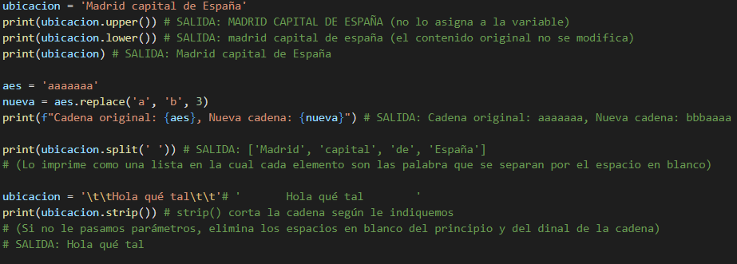
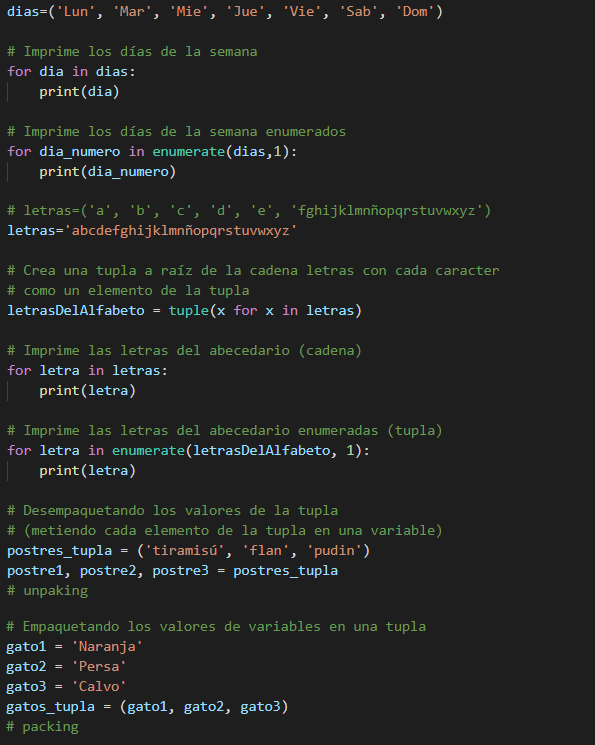
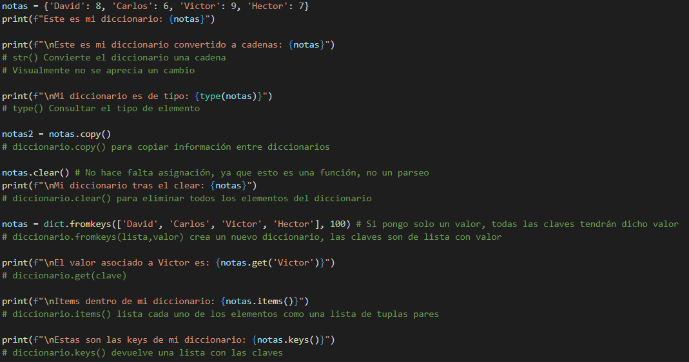
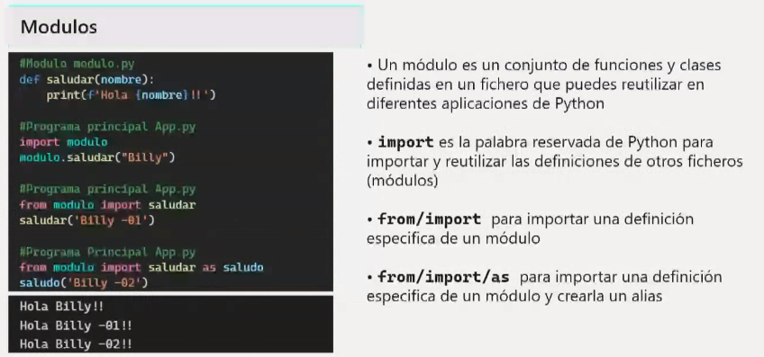
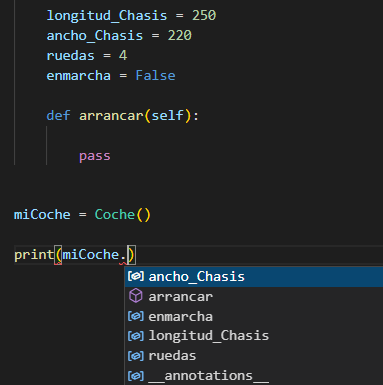
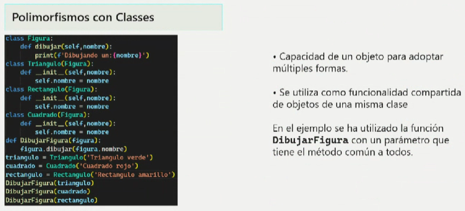

# Índice
Pincha para ir a la sección:

>> * [Funciones útiles (link)](https://github.com/CristinaSilvan/EOI-IntroProgramacionPython/blob/main/Apuntes/Funciones%20%C3%BAtiles.md)

>* [<span style="color:Pink">Introducción</span>](#Introducción)
>
>* [<span style="color:Pink">Para trabajar con Python</span>](#para-trabajar-con-python)
>
>* [<span style="color:Pink">Zen de Python</span>](#el-zen-de-python)
>
>* [<span style="color:Pink">Comentarios</span>](#Comentarios)
>
>* [<span style="color:Pink">Declaración de variables</span>](#declaración-de-variables)
>
>* [<span style="color:Pink">La salida de nuestros programas</span>](#la-salida-de-nuestros-programas)
>
>* [<span style="color:Pink">Tipos de datos en Python</span>](#tipos-de-datos-en-python)
>
>* [<span style="color:Pink">Conversiones de tipos</span>](#conversiones-de-tipos)
>
>* [<span style="color:Pink">Cadenas de caracteres</span>](#cadenas-de-caracteres)
>
>* [<span style="color:Pink">Funciones útiles para cadenas</span>](#funciones-útiles-para-cadenas)
>
>* [<span style="color:Pink">Pedir por pantalla (ENTRADA)</span>](#pedir-por-pantalla-entrada)
>
>* [<span style="color:Pink">Imprimir en pantalla (SALIDA)</span>](#imprimir-en-pantalla-salida)
>
>* [<span style="color:Pink">Importar</span>](#importar)
>
>* [<span style="color:Pink">Fechas y horas</span>](#fechas-y-horas)
>
>* [<span style="color:Pink">Parse de Fechas</span>](#parse-de-fechas)
>
>* [<span style="color:Pink">Formato de fechas</span>](#formato-de-fechas)
>
>* [<span style="color:Pink">Time</span>](#time)
>
>* [<span style="color:Pink">Instalación/Actualización pip</span>](#instalaciónactualización-pip)
>
>* [<span style="color:Pink">Utilizar pip para instalar módulos</span>](#utilizar-pip-para-instalar-módulos)
>
>* [<span style="color:Pink">Operadores</span>](#operadores)
>
>* [<span style="color:Pink">Sentencias de decisión (If/Else)</span>](#sentencias-de-decisión-ifelse)
>
>* [<span style="color:Pink">Sentencias iterativas o bucles (For/While/DoWhile)</span>](#sentencias-iterativas-o-bucles-forwhiledowhile)
>
>* [<span style="color:Pink">Recorrer una colección</span>](#recorrer-una-colección)
>
>* [<span style="color:Pink">Control de excepciones I</span>](#control-de-excepciones-i)
>
>* [<span style="color:Pink">Control de excepciones II</span>](#control-de-excepciones-ii)
>
>* [<span style="color:Pink">Colecciones de datos I</span>](#colecciones-de-datos-i)
>
>* [<span style="color:Pink">Colecciones de datos II</span>](#colecciones-de-datos-ii)
>   
>    * [Strings](#string-o-cadenas) 
>    * [Listas](#listas) 
>    * [Tuplas](#tuplas) 
>    * [Sets](#sets-o-conjuntos) 
>    * [Diccionarios](#diccionarios) 
>    * [Arrays y Matrices](#arrays-y-matrices) 
>    * [Json](#json)
>    * [Nested Data](#nested-data)
>    * [RESUMEN COLECCIONES](#resumen-colecciones)
>* [<span style="color:Pink">Colecciones de datos III</span>](#colecciones-de-datos-ii)
>    * [Comprehesion](#comprehesion)
>
>* [<span style="color:Pink">Crear/Declarar funciones</span>](#creardeclarar-funciones)     
>   *  [Lambda](#funciones-lambda)
>   *  [Funciones asíncronas](#funciones-asíncronas)
>
>* [<span style="color:Pink">SOLID</span>](#solid)
>
>* [<span style="color:Pink">Módulos</span>](#módulos)
>
>* [<span style="color:Pink">Generadores</span>](#generadores)
>
>* [<span style="color:Pink">Crear/Leer ficheros</span>](#crearleer-ficheros)
>
>* [<span style="color:Pink">Depuración</span>](#depuración)
>
>* [<span style="color:Pink">Programación Orientada a Objeto (POO)</span>](#programación-orientada-a-objetos-poo) 
>    * [Clases](#clases) 
>    * [Herencia](#herencia) 
>    * [Polimorfismo](#polimorfismo)
>
>* [<span style="color:Pink">Recursividad</span>](#recursividad)
>
>* [<span style="color:Pink">Otros</span>](#otros)
>
>* [<span style="color:Pink">Fecha Exámenes</span>](#fecha-exámenes)


# Introducción
Es un lenguaje de alto nivel **interpretado** dinámico, es decir, que allá donde se ejecute debe ir con su interpretador

Ejemplos de aplicaciones mayormente programadas en **Python**: Netflix, Instagram, Panda 3D, ...

Es un lenguaje multiplataforma y multiparadigma, ya que soporta **parcialmente** la orientación a objetos, programación imperativa y, en menor medida, programación funcional

Es de **código abierto**, lo cual implica que en su página oficial, se puede consultar públicamente su código fuente e incluso aportar cambios (de ahí que su comunidad ayude a la mejora de este)

Administrado por **Python Software Foundation**
(Código abierto: **Python Software Foundation License**)

Se clasifica en la actualidad entre los lenguajes de programación **más populares**


>>[<span style="color:Pink">Pincha aquí para volver al índice</span>](#índice)


# Para trabajar con Python

Se puede descargar el **IDLE de Python** o **Visual Studio Code** instalando la extensión de **Python** desarrollada por Microsoft junto a una extensión de **Júpiter**


Se puede configurar el entorno para ejecutar mi programa en la versión en la que lo realicé a pesar de las actualizaciones del lenguaje actuales (**aisla el programa en el contexto de la versión para evitar fallos con la actualización o tener que importar nuevos paquetes/librerías**)

>>[<span style="color:Pink">Pincha aquí para volver al índice</span>](#índice)


# El Zen de Python
Para comprobar que la instalación de Python es correcta, escribimos py en la consola de Windows y luego **import this**:


Al escribir el comando **py**, la consola de Windows abre el intérprete de Python

**Ctr + Z + Enter** para salir del intérprete de Python y volver a la consola de Windows


>>[<span style="color:Pink">Pincha aquí para volver al índice</span>](#índice)


# Comentarios 
Para hacer comentarios en Python:


# Declaración de variables

Python **intuye** el tipo de dato de la variable, por lo que no es necesaria declararla ya especificada (se le conoce como **Tipo Diferido**)

Le otorga el tipo de dato en el momento que se le agrega un valor

Python es **case sensitive**, por lo que debemos tener cuidado a la hora de identificar las variables y utilizarlas

Forma de **declararlas** y algunas **funciones útiles**:


>(**NOTA: es importante seguir el convenio de identificación de variables, que no empiecen por número, que no contengan espacios, etc... en apuntes anteriores de [Fundamentos de Programación](https://github.com/CristinaSilvan/FundamentosProgramacionEOI/blob/main/Apuntes/Anotaciones_de_clase_diario/(4)_20_Abril.md)**)

>>[<span style="color:Pink">Pincha aquí para volver al índice</span>](#índice)


# La salida de nuestros programas

La salida estandar, es la pantalla

Nuestros programas, si no le especificamos lo contrario, imprimiran en la consola y esta saldrá en la pantalla

>>[<span style="color:Pink">Pincha aquí para volver al índice</span>](#índice)


# Tipos de datos en Python


El tipo **Unicode** se utiliza para caracteres especiales de otros lenguajes
(nos permite añadir en nuestras cadenas dichos caracteres)

>>[<span style="color:Pink">Pincha aquí para volver al índice</span>](#índice)


# Conversiones de tipos


El **tipado** de Python es muy flexible, por lo que, si introducimos un valor numérico a una variable para luego asignarle un valor alfanumérico, el mismo hará la conversión internamente sin tener que especificarlo nosotros

>>[<span style="color:Pink">Pincha aquí para volver al índice</span>](#índice)


# Cadenas de caracteres


Para acceder a cada una de las posiciones de la cadena, al igual que un **array**, se indica de la siguiente forma:
```
nombre="Cristina"
print(nombre[0]) # C
print(nombre[1]) # r
print(nombre[2]) # i
print(nombre[3]) # s
print(nombre[4]) # t
print(nombre[5]) # i
```

También se puede imprimir por rango:
```
nombre="Cristina"
print(nombre[0:6]) # Cristi (no imprime posición 6)
```

Si pido que imprima una posición negativa, cuenta en retroceso desde el final:
```
nombre="Cristina"
print(nombre[-2]) # n
```
(a = -1 | n = -2 | i = -3 | t = -4 | s = -5 | i = -6 | r = -7 | C = -8)

>>[<span style="color:Pink">Pincha aquí para volver al índice</span>](#índice)


# Pedir por pantalla (ENTRADA)

Con la función **input()**

Lo asignamos directamente a una variable
```
print("Escriba su nombre: ")
nombre = input()
```

```
nombre = input("Escriba su nombre: ")
```
>(**NOTA: por defecto, si no especificamos una conversión de tipo, trata el valor que introduce el usuario como STRING**)

```
numero = int(numero)
```


>>[<span style="color:Pink">Pincha aquí para volver al índice</span>](#índice)


# Imprimir en pantalla (SALIDA)

* La forma más **eficiente** es con el format:

(porque coge las cadenas y las concatena, mientras que las demás crean una nueva cadena con el resultado de la concatenación)
```
nombre = "Cristina"
edad = 24
print("Mi nombre es {nombre} y tengo {edad}".format(nombre,edad))
```

```
nombre = "Cristina"
edad = 24
print("Mi nombre es {n} y tengo {e}".format(n = nombre, e = edad))
```

```
nombre = "Cristina"
edad = 24
print("Mi nombre es {} y tengo {}".format(nombre, edad))
```
* Usar **format** para imprimir el resultado de una forma específica:

```
numero = 10/3
print("El resultado es {n:1.2}".format(n=numero)) 
# 1.2 significa "un entero con dos decimales"

# En lugar de imprimir 3.3333333333 
# imprime 3.33
```

* Una alternativa simple para usar **format**:

```
print(f"Mi nombre es {nombre} y tengo {edad}")
```

* Otras formas menos eficientes de imprimir:

```
print("Mi nombre es ", nombre, " y tengo ", edad)
```

```
print("Mi nombre es " + nombre + " y tengo " + edad)
```


>>[<span style="color:Pink">Pincha aquí para volver al índice</span>](#índice)


# Importar

Cada vez que necesitemos usar **funciones** y demás que no vengan de forma nativa con el lenguaje, debemos **importar** el módulo correspondiente 
* Vienen implícitos en la instalación, pero no se encuentran en uso mientras no lo especifique

* Eso permite al programa ser más eficiente ya que solo utiliza los módulos que necesitemos usar


>>[<span style="color:Pink">Pincha aquí para volver al índice</span>](#índice)


# Fechas y horas

Python no trata las fechas de forma **nativa**, lo cual significa que debemos importar **módulos** o **librerías**


* Now().date() -> Imprime la fecha actual (**SIN** la hora)
* Now() -> Imprime la fecha actual (**CON** la hora)

Si le asignamos a una variable de tipo **datetime** la función **now().date()**, no albergará la hora y no podremos acceder a esta con **.hour** o **.minute**
(Entonces, tendríamos que usar la función **now()**)

>(**NOTA: En este caso, importamos solo la parte del módulo que vamos a usar**)


>>[<span style="color:Pink">Pincha aquí para volver al índice</span>](#índice)


# Parse de Fechas


En este caso, el Parse o Parseo **analiza gramaticalmente** la cadena y crea un **objeto** de la clase datetime con la información que obtiene de la cadena

En el ejemplo de la imagen, **recibe una cadena** (en este caso ya declarado) y la **convierte** a una variable de tipo **Datetime**

Consultar [Ejercicio de parseo de fechas](https://github.com/CristinaSilvan/EOI-IntroProgramacionPython/blob/main/Ejercicios%20de%20Clase/ParseFechas.py) para más info


>>[<span style="color:Pink">Pincha aquí para volver al índice</span>](#índice)


# Formato de fechas


**.strftime()** nos permite modificar la forma en la que imprime la fecha de forma más estética e incluso podemos salirnos del formato por defecto americano

Para establecer por defecto el formato de tiempo en **ESPAÑA**:


>>[<span style="color:Pink">Pincha aquí para volver al índice</span>](#índice)

# Time


**pip** nos sirve para importar **módulos** que no se encuentran dentro del paquete de instalación de Python

El módulo **Pytz** nos permite trabajar con diferentes zonas horarias (no viene por defecto instalado en Windows)

**print(pytz.all_timezones)** me aparece la lista con todas las zonas horarias existentes

Ej. : **print(datetime.now(pytz.timezone('Asia/Tokyo')))** para ver la zona horaria de Tokyo

(**NOTA: si escribo pip list en la consola de Windows, me hace un listado de los paquetes de Python que contiene actualmente mi computadora**)

(**Estos pueden ser ampliados como menciono anteriormente**)

>>[<span style="color:Pink">Pincha aquí para volver al índice</span>](#índice)


# Instalación/Actualización pip

* Activar "ver archivos ocultos" en el explorador


* Guardar [enlace](https://bootstrap.pypa.io/get-pip.py) como fichero en la dirección donde se encuentra instalado Python con nombre **get-pip.py**

(Ej. : Usuario\\<**_NombreUsuario_**>\AppData\Local\Programs\Python\Python310\\)

* Abrir la consola de Windows, entrar en la ruta donde se encuentra instalado Python con el comando **cd**

(Ej. : cd Usuario\\<**_NombreUsuario_**>\AppData\Local\Programs\Python\Python310\\)

* Escribir los comandos **python get-pip.py**

* Entrar en las **variables del entorno**

    

* Copiar la ruta donde está ahora instalado el **pip**

(Ej. : Usuario\\<**_NombreUsuario_**>\AppData\Local\Programs\Python\Python310\Scripts\\)

* Pinchamos en **Variables de entorno**

* En la parte de variables del sistema, pinchamos **Nueva**

* Añadimos **pip** como variable de sistema

    

* Para comprobar que se ha instalado correctamente, escribir los comandos **pip list**

* Debe aparecer algo similar a la siguiente imagen en la que se listan los módulos externos de Python:

    

* Escribir los comandos **python -m pip install –upgrade pip** para finalizar actualizando el **pip**

(Alternativa para instalar y actualizar: **py -m pip install -U pip**)

>(**NOTA: [Alternativa para instalar pip en mac y linux](https://tecnonucleous.com/2018/01/28/como-instalar-pip-para-python-en-windows-mac-y-linux/)**)

# Utilizar pip para instalar módulos

**pip install <_nombremodulo_>** (sin los signos <>)

**pip list** para comprobar que se instaló el módulo

>>[<span style="color:Pink">Pincha aquí para volver al índice</span>](#índice)


# Operadores


Los operadores también se consideran **palabras reservadas** o **key words**, lo que significa que no podemos usarlos como **identificadores** para variables, funciones, ... y siempre cumpliran su función especificada

Estos operadores son únicamente para **Python** ya que muchos de ellos no los encontraremos en otros lenguajes o se mostrarán de otra forma

A la hora de aprender un lenguaje, debemos buscar independientemente sus **operadores** porque suelen variar

En este lenguaje, por ejemplo, no podemos usar el incremento **++** o decremento **--** al contrario que en la familia de lenguajes C
(C, C#, C++, Objetive-C)

En los operadores condicionales, el **==** compara según el valor, mientras que **is** compara según la clase del objeto

>>[<span style="color:Pink">Pincha aquí para volver al índice</span>](#índice)


# Sentencias de decisión (If/Else)


Sentencias que le indican a mi código, qué instrucciones debe realizar y cuáles no, según una condición que será verdadera o falsa

En el lenguaje **Python** no existe la función **según caso** o **switch** (en su lugar, adapta sentencias **if** **else**)
(existen módulos **no nativos** que tratan de adaptar esta sentencia)

En los lenguajes de la familia C (C, C#, C++, Objetive-C), la palabra reservada **elif** se identifica como **else if**

* Forma compacta de escribir **if/else**:
    ```
    print("Yes") if 5 > 2 else print("No")
    ```


>>[<span style="color:Pink">Pincha aquí para volver al índice</span>](#índice)


# Sentencias iterativas o bucles (For/While/DoWhile)


En **Python**, el bucle **for**, al contrario que en otros lenguajes, no tiene una condición **HASTA** (debemos resolverlo con el **range()**)

```
Ejemplo bucle "HASTA" en C#

for(int i = 0; i < 10; i++){
    print(i)
}

Imprime: 0 1 2 3 4 5 6 7 8 9
```
En este ejemplo, el bucle sabe cúando **debe acabar** antes de iniciar, mientras que en **Python**, el bucle for sería similar a un **for each** en **C#** donde el **range()** sustituye a la cadena o lista que recorre el bucle

--- ---

Por defecto, si no le especifico más datos al **range(n)**, recorrerá desde **0 hasta n** (n no incluido) **incrementando 1**

En el momento que el compilador/intérprete encuentre la sentencia **Continue**, saltará a la siguiente iteración sin leer las instrucciones bajo este

El **break** realizaría algo similar al **continue**, salvo que este no permite que el bucle se siga iterando y lo termina inmediatamente (continúa con el script bajo el bucle)

El **break** y el **continue** pueden usarse también en **sentencias condicionales** con resultados similares (pero su potencial se encuentra en el trabajo con bucles)

>(**NOTA: en Python solo pueden usarse dentro de los bucles al contrario que en la familia de lenguajes C**)


>>[<span style="color:Pink">Pincha aquí para volver al índice</span>](#índice)


# Colecciones de datos I


Son "conjuntos de variables" de distinto o mismo tipo
    
* (Homogéneo = del mismo tipo \\ Heterogéneo = distinto tipo)

En lugar de crear 10 variables, creamos un array con 10 posiciones que almacena esos 10 valores

Cada valor se encuentra en una **posición**, contando el 0 como primera posición


>>[<span style="color:Pink">Pincha aquí para volver al índice</span>](#índice)


## Recorrer una colección


FORMA 1: Creamos una variable **i** que **empiece en 0** e **incremente en uno** hasta el tamaño de la colección (que coindice con la última posición), y utilizamos dicha variable **i** para acceder a **cada una de las posiciones** del array como en la imagen anterior

FORMA 2: Creamos una variable **len** y le especificamos al **bucle for** que la colección que queremos recorrer es **lenguajes**, automáticamente se encargará de asignar a la variable **len** el valor dentro de cada posición de la colección

>>[<span style="color:Pink">Pincha aquí para volver al índice</span>](#índice)


# Control de excepciones I


Si hay un **error** en mi programa, este se detendrá en la línea donde exista el problema parando por completo su ejecución

Por este motivo, existen las **excepciones** que controlan esos errores en **tiempo de ejecución** para no detener el programa

Las excepciones dan una solución a un error (o posible error, zona del código **susceptible de tener errores**), impidiendo que el programa se detenga o congele

* **Run Time Error**: errores que el entorno de desarrollo no detecta o que no son errores de sintaxis como tal. Se producen una vez se ejecute el programa

    

Este código daría un error en tiempo de ejecución (**Run Time Error**) imposible de preveer para el entorno que usamos para desarrollar el programa

Debemos preveer los posibles errores de **acceso a datos vacíos o nulos**, posibles operaciones **con valores erróneos** y demás problemas que congelarían nuestro programa


En programación, existen **errores comunes** (como la división entre cero) que ya tienen tratamiento previamente programado y cuya solución podemos usar llamando a esa excepción particular, como en el ejemplo **ZeroDivisionError**

En general, cuando pedimos al usuario que introduzca un dato por pantalla o que el script lea un fichero, existe la posibilidad de que introduzca algo **erróneo** que rompa nuestro programa; por lo que la introducción de datos siempre es una **zona de peligro** en los programas que debe tener **excepciones** ya preparadas para que no rompa nuestro programa (**sino, puede desencadenar en caidas en bases de datos, colapso de aplicaciones, congelaciones, ataques cibernéticos aprovechando debilidades en el código y demás con consecuencias desastrosas**)

Por esto, debemos considerar **zonas de peligro** en nuestro código propensas a **errores** (Ej. : introducir -1 en un ejercicio de calcular primos o escribir caracteres alfabéticos en una calculadora de dígitos)

Si existen varios errores, se ejecutará la excepción del primero (teniendo **prioridades** las excepciones según el orden en las que las declaremos)

>>[<span style="color:Pink">Pincha aquí para volver al índice</span>](#índice)


# Colecciones de datos II

## String o cadenas




Las cadenas de caracteres  son **inmutables**, lo cual significa que no pueden ser modificadas. En un primer momento puede no apreciarse ya que podemos hacer, por ejemplo:

```
cadena = 'Cristina'
cadena = 'Silván
```

Esta segunda asignación puede hacerlas parecer **mutables** cuando internamente no están siendo modificada, sino que se está creando una segunda cadena y la está asignando a la variable como si la crease desde cero

Esto no ocurre en las colecciones de datos **mutables**, como las listas, en las cuales no les hace falta ser creadas de nuevo

Puede no apreciarse a nivel de código, pero es muy importante tener esto en cuenta por la **eficiencia**

Existen ejemplos de trabajo con cadenas donde si podemos observar las limitaciones al ser una colección **inmutable**, por ejemplo:

```
cadena = 'Cristina'
cadena[0] = p
# Error, ya que no puede ser modificada
# Este error no ocurriría si la colección fuese una lista
```


* **find()** devuelve **-1** si no existe ese caracter en la cadena

* **find()** es sensible a **mayúsculas y minúsculas**

    

* **replace()** puede reemplazar un número específico de veces, en lugar de cada vez que encuentre el caracter a reemplazar, y esto se especifica mediante un tercer parámetro de tipo entero
    * Ej.: replace('a', 'b', 1) reemplazará b por a una sola vez

    

* **format()** detecta las llaves **{}** e introduce en ellas los datos que nosotros le demos por parámetros en el mismo orden (pueden ser caracteres, cadenas o variables)

    
    

* **count()** cuenta **cada aparición** del dato que le pasemos por parámetros en la cadena que le especifiquemos

    
    

* **\\n** es un caracter especial que le indica a la salida que haga un **salto de línea**, **retorno de carro** o **Enter**

    

* **\\t** es un caracter especial que le indica a la salida que haga un **salto de tabulador**

    

* La **concatenación** es la **unión** de cadenas (String) o caracteres alfabéticos (char) en una sola colección de datos y se puede realizar con el operador **+**

    
* **"Multiplicando"** cadenas, hacemos que se repitan o dupliquen

    


>>[<span style="color:Pink">Pincha aquí para volver al índice</span>](#índice)


## Listas


Python tiene una cosa llamada **List Comprehesion** que básicamente es una forma simple de crear una segunda lista basada en la primera sin necesidad de recorrer la lista principal con **bucles**

En esta imagen, se muestra cómo el interior de los cuadrados realiza exactamente **lo mismo**, salvo que el segundo cuadro (**List Comprehesion**) es más **eficiente y simple**

> **(NOTA: la List Comprehesion también puede usarse con diccionarios)**


* **split()** separa una cadena según el **separador** que le especifiquemos por parámetros y crea una **lista** con cada parte separada


>(**NOTA: al asignarle a cadena = cadena.split(), cadena deja de ser un string y se convierte a lista**)


>>[<span style="color:Pink">Pincha aquí para volver al índice</span>](#índice)

## Tuplas


Una colección de datos **heterogénea**, es aquella que puede albergar distintos tipos de datos

```
lista = ['Cadena', 1, True]
```

Una colección de datos **homogénea**, es aquella que no puede albergar distintos tipos de datos

```
cadena = 'hola'
# Todos sus posiciones son ocupadas por valores alfanuméricos

# Incluso si asignamos un valor entero
# se convierte a una cadena de valores alfanuméricos
```





>>[<span style="color:Pink">Pincha aquí para volver al índice</span>](#índice)

## Sets o conjuntos


Los sets no contienen **elementos repetidos**


>>[<span style="color:Pink">Pincha aquí para volver al índice</span>](#índice)

## Diccionarios





>>[<span style="color:Pink">Pincha aquí para volver al índice</span>](#índice)

## Arrays y Matrices


>>[<span style="color:Pink">Pincha aquí para volver al índice</span>](#índice)

# Json


**JSON** viene de la abreviatura **JavaScript Object Notation**

Es **completamente transparente** y funciona en cualquier plataforma sin tener que modificar su código

[Vídeo explicatico I](https://www.youtube.com/watch?v=SOimkkfQIOM)

>(**NOTA: se debe importar el módulo json**)

**Serializar** es convertir un objeto a tipo **Json** (packing, en los otros tipos de colecciones) y **deserializar** es lo opuesto (unpacking, en los otros tipos de colecciones)


Las formas **alternativas de administrar las cadenas de texto** que van a ser serializadas o "parseadas" a JSON, afectan al resultado aunque no se detecte como un error, por lo que debemos hacerlo de la **primera forma**:


**dumps()** nos devuelve un objeto JSON que se considera de tipo String internamente

**loads()** nos devuelve un objeto tipo de colección compleja que decidirá según el contenido o formato (diccionario, lista, ...)

Forma de recorrer el objeto deserializado de tipo Diccionario:


>>[<span style="color:Pink">Pincha aquí para volver al índice</span>](#índice)

# Nested Data

>>[<span style="color:Pink">Pincha aquí para volver al índice</span>](#índice)

# Resumen Colecciones


* Las cadenas se declaran entre **' '** o  **" "**, solo pueden albergar **caracteres alfanuméricos**, aceptan elementos **repetidos**, son **desordenados** y son **inmutables** (aunque se pueden reasignar)

* Las listas se declaran entre **[]**, pueden albergar **distintos tipos de datos** u objetos (colecciones inclusive), aceptan elementos **repetidos**, son **desordenados** y son **mutables**

* Las tuplas se declaran entre **( )**, pueden albergar **distintos tipos de datos** u objetos (colecciones inclusive), aceptan elementos **repetidos**, son **desordenados** y son **inmutables**

* Los sets se declaran entre **{ }** (preferiblemente con la función **set()** para que no se cree un diccionario por error), pueden albergar **distintos tipos de datos** u objetos (no aceptan colecciones como elementos), **no aceptan elementos repetidos** (los elimina automáticamente), son **ordenados** y son **mutables**

* Los sets pueden ser declarados con **frozenset** para que sean **inmutables**

* Los diccionarios se declaran entre **{ }**, pueden albergar **distintos tipos de datos** u objetos (colecciones inclusive, solo como valores NO COMO CLAVES), son **desordenados** y son **mutables**

>>[<span style="color:Pink">Pincha aquí para volver al índice</span>](#índice)

# Crear/Declarar funciones


Se definen siempre **al principio** del programa


Ejemplo de declaración de función y ejecución/llamada:


Ejemplo devolver/retornar un valor y asignarlo a variable:


Las variables pueden devolver o no datos, según queramos

Si la función va a tener un **número indefinido** de argumentos, se le pone un asterisco en la declaración (**Ej.: def suma (*a)**)

Si queremos que la función **trate como un diccionario** el argumento o argumentos que recibe, se le ponen dos asteriscos en la declaración (**Ej.: def suma(*\**a)**)

>>[<span style="color:Pink">Pincha aquí para volver al índice</span>](#índice)

# Funciones lambda


Una forma de **crear** una función de una forma corta y anónima, cuyo resultado debe ser **asignado a una variable** 

Cuando nos referimos a ella como **anónima**, significa que no usa un identificador. Simplemente usamos la palabra reservada **lambda** y acto seguido la instrucción que va a realizar

Se utilizan para funciones **pequeñas y simples** que se realizan en una sola instrucción


>>[<span style="color:Pink">Pincha aquí para volver al índice</span>](#índice)

# Funciones asíncronas


Muy útil para el trabajo con **threats** o **hilos** a la hora de realizar múltiples tareas

Al encontrar la sentencia **await**, crea un segundo hilo de ejecución que termina cuando **despierta del sleep**, volviendo al hilo principal y continuando con el código

>>[<span style="color:Pink">Pincha aquí para volver al índice</span>](#índice)

# SOLID

Buenas prácticas, especialmente en la programación orientada a objetos, que debemos seguir para ser eficientes y buenos programadores

Estas **prácticas** son:

*   **Principio de responsabilidad única:** lo cuál significa que las funciones deben estar desarrolladas únicamente para resolver el problema por el que la creamos o con el que la identificamos    
        * (**Ej.: Si creo una función suma(a,b), dentro de ella no puedo hacer que también me calcule el logaritmo**)

>>[<span style="color:Pink">Pincha aquí para volver al índice</span>](#índice)


# Módulos



Ejemplo creación y llamada a un módulo


* Para imprimir toda la información del módulo:
    ```
    print(dir(module_name))
    ```

>>[<span style="color:Pink">Pincha aquí para volver al índice</span>](#índice)

# Generadores


Ambos, **función** y **generador**, funcionan igual en cuanto a creación y llamadas

La diferencia está en que el generador, no devuelve o imprime la cadena **inmediatamente**, sino que su ejecución queda en **suspensión** hasta la **próxima llamada**

De esta forma, devolveríaen el ejemplo de la imagen, devolvería de uno en uno los **enteros pares** con cada llamada


La palabra reservada **return** es sustituida por **yield**

Ejemplo de una función y un generador que realizan lo mismo:


Para realizar esto, hace uso de la función **next**

Los generadores también pueden hacer uso del **yield from** para recorrer bucles anidados, similares al acceso de elementos en **matrices** o **arrays de dos dimensiones**, de una forma más sencilla:


* Ejemplo de obtener elementos de uno en uno:

    

* Ejemplo de obtener subelementos con **bucles anidados** (forma básica):

    

* Ejemplo de obtener subelementos con **yield from** sin necesidad de anidación:

    

>>[<span style="color:Pink">Pincha aquí para volver al índice</span>](#índice)

# Crear/Leer ficheros


* **Metadatos**: información relacionada con el objeto que no va a ser visualizada por el usuario final pero que indican al pc, programa que lo use y al programador, información útil sobre cómo tratar con él

* **EOF**: Forma que indican los metadatos que el fichero ha terminado en tal punto (no confundir con extensión del archivo)


Cómo **acceder a ficheros** en Python:


Modos en los que se puede acceder a ellos (**Modo de apertura**):


>>[<span style="color:Pink">Pincha aquí para volver al índice</span>](#índice)

# Depuración


>>[<span style="color:Pink">Pincha aquí para volver al índice</span>](#índice)

# Control de excepciones II

[Pincha aquí para ver la lista de excepciones predefinidas en Python](https://docs.python.org/3/library/exceptions.html)


Las **excepciones predefinidas** son aquellas más comunes ya capturadas previamente por otros programadores y que vienen por defecto en el lenguaje

Estas evalúan el error ocurrido y deciden qué tipo de excepción es para **ejecutar un bloque de código u otro**

Esto es de mucha ayuda también para identificar dónde está el problema

Por esto es **recomendable** usar excepciones predefinidas o personalizadas (**creados por nosotros mismos**) para capturar los errores en lugar de usar un **except** genérico


Si necesitamos que un **bloque de código** se ejecute pese al error, existe la palabra reservada **finally** que fuerza al programa a realizar las líneas que contiene haya error o no

Esto es muy útil en ciertos programas donde las excepciones no permiten al programa continuar con las líneas debajo suya 


Existe la palabra reservada **raise**, que tras capturar la zona de error, nos permite especificarle el **tipo de excepción** (TypeError como en la imagen) y customizar el mensaje que devuelve esta excepción **predefinida**, que por defecto devolvería otro mensaje


>>[<span style="color:Pink">Pincha aquí para volver al índice</span>](#índice)

# Programación orientada a objetos (POO)

[Enlace explicativo](https://www.youtube.com/watch?v=5Ohme4A2Weg&list=PLU8oAlHdN5BlvPxziopYZRd55pdqFwkeS&index=24&ab_channel=pildorasinformaticas)

**Categorización de los paradigmas de programación:** 


* Desventajas de la **programación orientada a procedimientos:**
    

* En qué consiste la **programación orientada a objetos:**
    
    

Se trata de observar los estados, comportamientos y propiedades de los **objetos de la vida real** y convertirlas a **atributos/variables y métodos/funciones** recreados en forma de código

* Ventajas de la **programación orientada a objetos:** 
    

El tratamiento de **excepciones**, corresponde a este tipo de programación, no compatible con los otros paradigmas


* **Clase:** Modelo o "plantilla" donde se redactan las características comunes de un grupo de objetos

* **Instancia u objeto:** Ejemplar perteneciente a una clase

* **Modularización:** División de la aplicación en diferentes partes (que funcionan de **forma independiente** y por lo tanto **portables** con otras aplicaciones (**reutilización**)) para resolver un problema. Si una parte no funciona, el resto normalmente sí (es más probable que el programa **no caiga**)

* **Encapsulación:** Los módulos funcionan, internamente, de forma independiente y **privada**. Los módulos están todos conectados y se comunican, pero no conocen el uno información del otro ni pueden modificarla sin permiso, para que esta **no sea accesible** desde "fuera"

La **Nomenclatura** del punto (Ej.: datetime.year), es la forma en la que se accede a los **atributos y métodos** de la clase a la que pertenece el objeto

El **Polimorfismo** es la posibilidad de tener distintos métodos, con el mismo identificador, pero distintos parámetros con los que variará de alguna forma lo que realiza cada método


>>[<span style="color:Pink">Pincha aquí para volver al índice</span>](#índice)

# Clases


Cómo llevar todos estos conceptos de **POO** a Python:


La nomenclatura del **punto**:
    
    

Llamadas a **métodos**:
    
    

**Los constructores** son métodos por los cuales se pueden customizar los **atributos** a la hora de instanciar un objeto y deben declararse con _\__init_\__ delante
    

También podemos crear **métodos** que nos permitan modificar dichos atributos tras la instanciación
    

La **encapsulación** o **privatización** de atributos o métodos se utiliza para que no se pueda acceder a ellas desde el exterior y debe declararse con _\__ delante del **identificador**
    


Uso del **Convenio property**:


>>[<span style="color:Pink">Pincha aquí para volver al índice</span>](#índice)

# Herencia


La **clase base** también es llamada **clase padre o superclase**

La **clase heredada** también es llamada **clase hija**


Todas las **clases heredadas** (Triángulo, Rectángulo y Cuadrado) tienen el método dibujar de la **superclase**

>>[<span style="color:Pink">Pincha aquí para volver al índice</span>](#índice)

# Polimorfismo


El polimorfismo, entre otras definiciones, significa que un objeto puede tomar **varias formas**

Como en el ejemplo de la imagen, figura dentro del método se convertirá a un objeto de tipo **Triangulo, Cuadrado o Rectangulo** según lo que sea pasado como argumento, todo esto sin tener que adaptar el código



>>[<span style="color:Pink">Pincha aquí para volver al índice</span>](#índice)

# Recursividad

Es una **técnica de programación** en la que se ejecuta una función que se llama a sí misma n veces y se transfiere los resultados a sí misma

Para esto es necesario un **caso base** que detenga la iteración de llamadas y retorne el resultado esperado de la función


>>[<span style="color:Pink">Pincha aquí para volver al índice</span>](#índice)

# Colecciones III

## Comprehesion

Formas de recorrer **Colecciones de Datos** de forma sencilla en lugar de con bucles anidados:


>>[<span style="color:Pink">Pincha aquí para volver al índice</span>](#índice)

# Otros

* Desde el intérprete de Python puedo abrir Studio Code con el comando **Code** seguido de la carpeta que queremos que abra o un punto para abrirlo en la actual

>(**NOTA: para ello debemos tener en nuestras variables de usuario, la dirección donde Studio Code está instalado; concretamente la varpeta bin**)

* Manteniendo pulsado **Alt**, podemos seleccionar varias partes del código por ejemplo para sustituir


* El comando **cls** también sirve para **limpiar la consola en Visual Studio Code**

* Para consultar módulos instalados de Python, escribir en el intérprete de Python **help('modules')**

* Los lenguajes interpretados, nos permiten trabajar directamente con el **intérprete** en lugar de crear un script y ejecutarlo

    

* Al pulsar el Alt Graphic (**Alt Gr**) en el teclado, escribe automáticamente los corchetes y llaves de **inicio y final**

* Pulsando **Alt** y las **flechas del teclado**, puedo mover las líneas de código de arriba a abajo

* A la hora de imprimir, **\n** sirve para saltar de línea y **\t** para tabular

* Los **entornos de desarrollo** o **IDE's** nos despliegan información sobre las funciones y demás cuando ponemos el cursor encima y/o pinchamos (**depende del entorno**)

    
    * En este ejemplo, nos muestra qué significa cada parámetro
    * El primero es la vieja cadena, el segundo es la nueva cadena y el tercero (**opcional**) las veces que queremos sustituir
    * También nos indica de qué **tipo de dato** o **clase** debe ser el parámetro para que la función haga su trabajo (**str = String** o cadena de caracteres)
    * Indica **-> Str** al final refiriéndose a que el **resultado** o lo que **devuelve** es un dato de tipo String o cadena de caracteres (**Sino devolviera nada**, funciones **void**, no podríamos asignar el resultado a una variable u ordenarle hacer un print) 

    
    * Nos especifica también de una forma simple que es lo que la función realiza

>>[<span style="color:Pink">Pincha aquí para volver al índice</span>](#índice)

# Fecha exámenes
    I. Python 19 de Mayo (C#) - 1 Hora

>>[<span style="color:Pink">Pincha aquí para volver al índice</span>](#índice)

>Si estás leyendo esto, dale una **estrellita** a mi repositorio ;)
 