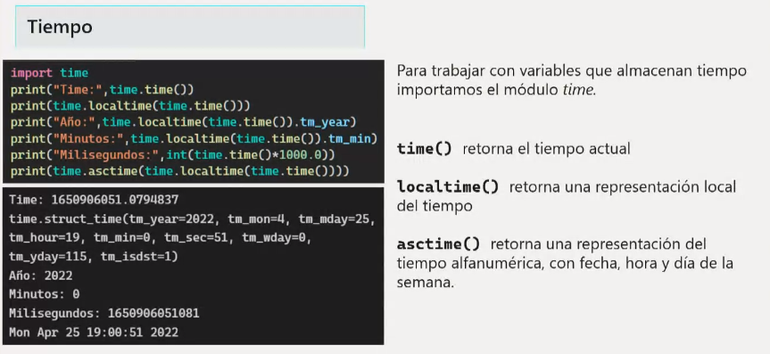

# Índice
1. [Introducción](#Introducción)
1. [Comentarios](#Comentarios)


# Introducción
Es un lenguaje de alto nivel **interpretado** dinámico, es decir, que allá donde se ejecute debe ir con su interpretador

Ejemplos de aplicaciones mayormente programadas en **Python**: Netflix, Instagram, Panda 3D, ...

Es un lenguaje multiplataforma y multiparadigma, ya que soporta **parcialmente** la orientación a objetos, programación imperativa y, en menor medida, programación funcional

Es de **código abierto**, lo cual implica que en su página oficial, se puede consultar públicamente su código fuente e incluso aportar cambios (de ahí que su comunidad ayude a la mejora de este)

Administrado por **Python Software Foundation**
(Código abierto: **Python Software Foundation License**)

Se clasifica en la actualidad entre los lenguajes de programación **más populares**


# Para trabajar con Python

Se puede descargar el **IDLE de Python** o **Visual Studio Code** instalando la extensión de **Python** desarrollada por Microsoft junto a una extensión de **Júpiter**


Se puede configurar el entorno para ejecutar mi programa en la versión en la que lo realicé a pesar de las actualizaciones del lenguaje actuales (**aisla el programa en el contexto de la versión para evitar fallos con la actualización o tener que importar nuevos paquetes/librerías**)

# El Zen de Python
Para comprobar que la instalación de Python es correcta, escribimos py en la consola de Windows y luego **import this**:


Al escribir el comando **py**, la consola de Windows abre el intérprete de Python

**Ctr + Z + Enter** para salir del intérprete de Python y volver a la consola de Windows


# Comentarios 
Para hacer comentarios en Python:


# Declaración de variables

Python **intuye** el tipo de dato de la variable, por lo que no es necesaria declararla ya especificada (se le conoce como **Tipo Diferido**)

Le otorga el tipo de dato en el momento que se le agrega un valor

Python es **case sensitive**, por lo que debemos tener cuidado a la hora de identificar las variables y utilizarlas

Forma de **declararlas** y algunas **funciones útiles**:


(**NOTA: es importante seguir el convenio de identificación de variables, que no empiecen por número, que no contengan espacios, etc... en apuntes anteriores de [Fundamentos de Programación](https://github.com/CristinaSilvan/FundamentosProgramacionEOI/blob/main/Apuntes/Anotaciones_de_clase_diario/(4)_20_Abril.md)**)

# La salida de nuestros programas

La salida estandar, es la pantalla

Nuestros programas, si no le especificamos lo contrario, imprimiran en la consola y esta saldrá en la pantalla

# Tipos de datos en Python


El tipo **Unicode** se utiliza para caracteres especiales de otros lenguajes
(nos permite añadir en nuestras cadenas dichos caracteres)

# Conversiones de tipos


El **tipado** de Python es muy flexible, por lo que, si introducimos un valor numérico a una variable para luego asignarle un valor alfanumérico, el mismo hará la conversión internamente sin tener que especificarlo nosotros

# Cadenas de caracteres


Para acceder a cada una de las posiciones de la cadena, al igual que un **array**, se indica de la siguiente forma:
```
nombre="Cristina"
print(nombre[0]) # C
print(nombre[1]) # r
print(nombre[2]) # i
print(nombre[3]) # s
print(nombre[4]) # t
print(nombre[5]) # i
```

También se puede imprimir por rango:
```
nombre="Cristina"
print(nombre[0:6]) # Cristi (no imprime posición 6)
```

Si pido que imprima una posición negativa, cuenta en retroceso desde el final:
```
nombre="Cristina"
print(nombre[-2]) # n
```
(a = -1 | n = -2 | i = -3 | t = -4 | s = -5 | i = -6 | r = -7 | C = -8)

# Funciones útiles para cadenas

* .isdigit() -> Si el valor es un dígito (No funciona con decimal)
* .isdecimal() -> Si el valor es un dígito
* .lower() -> Convertir en minúsculas
* .upper() -> Convertir a mayúsculas
* .swapcase() -> Convertir minúsculas a mayúsculas y viceversa
* len(**_cadena_**) -> Longitud de la cadena
* .capitalize() -> El primer caracter en mayúsculas y el resto en minúsculas
* .count(**_caracter_**) -> Cuenta cuántas veces se repide el caracter
* .replace(**_cadena1_**, **_cadena2_**) -> Reemplaza la cadena1 por la cadena2
* .find(**_cadena_**) -> Enumera los caracteres existentes hasta la cadena seleccionada

# Pedir por pantalla (ENTRADA)

Con la función **input()**

Lo asignamos directamente a una variable
```
print("Escriba su nombre: ")
nombre = input()
```

```
nombre = input("Escriba su nombre: ")
```
(**NOTA: por defecto, si no especificamos una conversión de tipo, trata el valor que introduce el usuario como STRING**)

```
numero = int(numero)
```


# Imprimir en pantalla (SALIDA)

* La forma más **eficiente** es con el format:

(porque coge las cadenas y las concatena, mientras que las demás crean una nueva cadena con el resultado de la concatenación)
```
nombre = "Cristina"
edad = 24
print("Mi nombre es {nombre} y tengo {edad}".format(nombre,edad))
```

```
nombre = "Cristina"
edad = 24
print("Mi nombre es {n} y tengo {e}".format(n = nombre, e = edad))
```

```
nombre = "Cristina"
edad = 24
print("Mi nombre es {} y tengo {}".format(nombre, edad))
```
* Usar **format** para imprimir el resultado de una forma específica:

```
numero = 10/3
print("El resultado es {n:1.2}".format(n=numero)) 
# 1.2 significa "un entero con dos decimales"

# En lugar de imprimir 3.3333333333 
# imprime 3.33
```

* Una alternativa simple para usar **format**:

```
print(f"Mi nombre es {nombre} y tengo {edad}")
```

* Otras formas menos eficientes de imprimir:

```
print("Mi nombre es ", nombre, " y tengo ", edad)
```

```
print("Mi nombre es " + nombre + " y tengo " + edad)
```


# Importar

Cada vez que necesitemos usar **funciones** y demás que no vengan de forma nativa con el lenguaje, debemos **importar** el módulo correspondiente 
* Vienen implícitos en la instalación, pero no se encuentran en uso mientras no lo especifique

* Eso permite al programa ser más eficiente ya que solo utiliza los módulos que necesitemos usar


# Fechas y horas

Python no trata las fechas de forma **nativa**, lo cual significa que debemos importar **módulos** o **librerías**


* Now().date() -> Imprime la fecha actual (**SIN** la hora)
* Now() -> Imprime la fecha actual (**CON** la hora)

Si le asignamos a una variable de tipo **datetime** la función **now().date()**, no albergará la hora y no podremos acceder a esta con **.hour** o **.minute**
(Entonces, tendríamos que usar la función **now()**)

(**NOTA: En este caso, importamos solo la parte del módulo que vamos a usar**)


# Parse de Fechas


En este caso, el Parse o Parseo **analiza gramaticalmente** la variable tipo **Datetime** para imprimir de forma estéticamente más agradable para el usuario

En el ejemplo de la imagen, **recibe una cadena** (en este caso ya declarado) y la **convierte** a una variable de tipo **Datetime**

Consultar [Ejercicio de parseo de fechas](https://github.com/CristinaSilvan/EOI-IntroProgramacionPython/blob/main/Ejercicios%20de%20Clase/ParseFechas.py) para más info

# Formato de fechas


Para especificar de una **mejor forma** el formato de la fecha, podemos usar esta otra función **.strftime()** que nos permite salirnos del formato por defecto americano

Para establecer por defecto el formato de tiempo en **ESPAÑA**:


# Time




**pip** nos sirve para importar **módulos** que no se encuentran dentro del paquete de instalación de Python

El módulo **Pytz** nos permite trabajar con diferentes zonas horarias (no viene por defecto instalado en Windows)

**print(pytz.all_timezones)** me aparece la lista con todas las zonas horarias existentes

Ej. : **print(datetime.now(pytz.timezone('Asia/Tokyo')))** para ver la zona horaria de Tokyo

(**NOTA: si escribo pip list en la consola de Windows, me hace un listado de los paquetes de Python que contiene actualmente mi computadora**)

(**Estos pueden ser ampliados como menciono anteriormente**)

# Instalación/Actualización pip

* Activar "ver archivos ocultos" en el explorador


* Guardar [enlace](https://bootstrap.pypa.io/get-pip.py) como fichero en la dirección donde se encuentra instalado Python con nombre **get-pip.py**

(Ej. : Usuario\\<**_NombreUsuario_**>\AppData\Local\Programs\Python\Python310\\)

* Abrir la consola de Windows, entrar en la ruta donde se encuentra instalado Python con el comando **cd**

(Ej. : cd Usuario\\<**_NombreUsuario_**>\AppData\Local\Programs\Python\Python310\\)

* Escribir los comandos **python get-pip.py**

* Entrar en las **variables del entorno**

    

* Copiar la ruta donde está ahora instalado el **pip**

(Ej. : Usuario\\<**_NombreUsuario_**>\AppData\Local\Programs\Python\Python310\Scripts\\)

* Pinchamos en **Variables de entorno**

* En la parte de variables del sistema, pinchamos **Nueva**

* Añadimos **pip** como variable de sistema

    

* Para comprobar que se ha instalado correctamente, escribir los comandos **pip list**

* Debe aparecer algo similar a la siguiente imagen en la que se listan los módulos externos de Python:

    

* Escribir los comandos **python -m pip install –upgrade pip** para finalizar actualizando el **pip**

(Alternativa para instalar y actualizar: **py -m pip install -U pip**)

(**NOTA: [Alternativa para instalar pip en mac y linux](https://tecnonucleous.com/2018/01/28/como-instalar-pip-para-python-en-windows-mac-y-linux/)**)

# Utilizar pip para instalar módulos

**pip install <_nombremodulo_>** (sin los signos <>)

**pip list** para comprobar que se instaló el módulo

# Operadores


Los operadores también se consideran **palabras reservadas** o **key words**, lo que significa que no podemos usarlos como **identificadores** para variables, funciones, ... y siempre cumpliran su función especificada

Estos operadores son únicamente para **Python** ya que muchos de ellos no los encontraremos en otros lenguajes o se mostrarán de otra forma

A la hora de aprender un lenguaje, debemos buscar independientemente sus **operadores** porque suelen variar

En este lenguaje, por ejemplo, no podemos usar el incremento **++** o decremento **--** al contrario que en la familia de lenguajes C
(C, C#, C++, Objetive-C)

En los operadores condicionales, el **==** compara según el valor, mientras que **is** compara según la clase del objeto

# Sentencias de decisión (If/Else)


Sentencias que le indican a mi código, qué instrucciones debe realizar y cuáles no, según una condición que será verdadera o falsa

En el lenguaje **Python** no existe la función **según caso** o **switch** (en su lugar, adapta sentencias **if** **else**)
(existen módulos **no nativos** que tratan de adaptar esta sentencia)

En los lenguajes de la familia C (C, C#, C++, Objetive-C), la palabra reservada **elif** se identifica como **else if**

# Sentencias iterativas o bucles (For/While/DoWhile)


En **Python**, el bucle **for**, al contrario que en otros lenguajes, no tiene una condición **HASTA** (debemos resolverlo con el **range()**)

```
Ejemplo bucle "HASTA" en C#

for(int i = 0; i < 10; i++){
    print(i)
}

Imprime: 0 1 2 3 4 5 6 7 8 9
```
En este ejemplo, el bucle sabe cúando **debe acabar** antes de iniciar, mientras que en **Python**, el bucle for sería similar a un **for each** en **C#** donde el **range()** sustituye a la cadena o lista que recorre el bucle

--- ---

Por defecto, si no le especifico más datos al **range(n)**, recorrerá desde **0 hasta n** (n no incluido) **incrementando 1**

En el momento que el compilador/intérprete encuentre la sentencia **Continue**, saltará a la siguiente iteración sin leer las instrucciones bajo este

El **break** realizaría algo similar al **continue**, salvo que este no permite que el bucle se siga iterando y lo termina inmediatamente (continúa con el script bajo el bucle)

El **break** y el **continue** pueden usarse también en **sentencias condicionales** con resultados similares (pero su potencial se encuentra en el trabajo con bucles)

(**NOTA: en Python solo pueden usarse dentro de los bucles al contrario que en la familia de lenguajes C**)


# Colecciones o arreglos/arrays


Son "variables" con varios valores heterogéneos (del mismo tipo) almacenados 

En lugar de crear 10 variables, creamos un array con 10 posiciones que almacena esos 10 valores

Su declaración es con corchetes **[]**

Cada valor se encuentra en una **posición**, contando el 0 como primera posición


# Recorrer una colección o array


FORMA 1: Creamos una variable **i** que **empiece en 0** e **incremente en uno** hasta el tamaño de la colección (que coindice con la última posición), y utilizamos dicha variable **i** para acceder a **cada una de las posiciones** del array como en la imagen anterior

FORMA 2: Creamos una variable **len** y le especificamos al **bucle for** que la colección que queremos recorrer es **lenguajes**, automáticamente se encargará de asignar a la variable **len** el valor dentro de cada posición de la colección

# Control de excepciones


Si hay un **error** en mi programa, este se detendrá en la línea donde exista el problema parando por completo su ejecución

Por este motivo, existen las **excepciones** que controlan esos errores para no detener el programa

Las excepciones dan una solución a un error (o posible error, zona del código **susceptible de tener errores**), impidiendo que el programa se detenga o congele

* **Run Time Error**: errores que el entorno de desarrollo no detecta o que no son errores de sintaxis como tal. Se producen una vez se ejecute el programa

    

Este código daría un error en tiempo de ejecución (**Run Time Error**) imposible de preveer para el entorno que usamos para desarrollar el programa

Debemos preveer los posibles errores de **acceso a datos vacíos o nulos**, posibles operaciones **con valores erróneos** y demás problemas que congelarían nuestro programa


En programación, existen **errores comunes** (como la división entre cero) que ya tienen tratamiento previamente programado y cuya solución podemos usar llamando a esa excepción particular, como en el ejemplo **ZeroDivisionError**

En general, cuando pedimos al usuario que introduzca un dato por pantalla o que el script lea un fichero, existe la posibilidad de que introduzca algo **erróneo** que rompa nuestro programa; por lo que la introducción de datos siempre es una **zona de peligro** en los programas que debe tener **excepciones** ya preparadas para que no rompa nuestro programa (**sino, puede desencadenar en caidas en bases de datos, colapso de aplicaciones, congelaciones, ataques cibernéticos aprovechando debilidades en el código y demás con consecuencias desastrosas**)

Por esto, debemos considerar **zonas de peligro** en nuestro código propensas a **errores** (Ej. : introducir -1 en un ejercicio de calcular primos o escribir caracteres alfabéticos en una calculadora de dígitos)

Si existen varios errores, se ejecutará la excepción del primero (teniendo **prioridades** las excepciones según el orden en las que las declaremos)

# Colecciones de datos
## String o cadenas


Las cadenas de caracteres  son **inmutables**, lo cual significa que no pueden ser modificadas. En un primer momento puede no apreciarse ya que podemos hacer, por ejemplo:

```
cadena = 'Cristina'
cadena = 'Silván
```

Esta segunda asignación puede hacerlas parecer **mutables** cuando internamente no están siendo modificada, sino que se está creando una segunda cadena y la está asignando a la variable como si la crease desde cero

Esto no ocurre en las colecciones de datos **mutables**, como las listas, en las cuales no les hace falta ser creadas de nuevo

Puede no apreciarse a nivel de código, pero es muy importante tener esto en cuenta por la **eficiencia**

Existen ejemplos de trabajo con cadenas donde si podemos observar las limitaciones al ser una colección **inmutable**, por ejemplo:

```
cadena = 'Cristina'
cadena[0] = p
# Error, ya que no puede ser modificada
# Este error no ocurriría si la colección fuese una lista
```

* **find()** devuelve **-1** si no existe ese caracter en la cadena

* **find()** es sensible a **mayúsculas y minúsculas**

    

* **replace()** puede reemplazar un número específico de veces, en lugar de cada vez que encuentre el caracter a reemplazar, y esto se especifica mediante un tercer parámetro de tipo entero
    * Ej.: replace('a', 'b', 1) reemplazará b por a una sola vez

    

* **format()** detecta las llaves **{}** e introduce en ellas los datos que nosotros le demos por parámetros en el mismo orden (pueden ser caracteres, cadenas o variables)

    
    

* **count()** cuenta **cada aparición** del dato que le pasemos por parámetros en la cadena que le especifiquemos

    
    

* **\\n** es un caracter especial que le indica a la salida que haga un **salto de línea**, **retorno de carro** o **Enter**

    

* **\\t** es un caracter especial que le indica a la salida que haga un **salto de tabulador**

    

* La **concatenación** es la **unión** de cadenas (String) o caracteres alfabéticos (char) en una sola colección de datos y se puede realizar con el operador **+**

    
* **"Multiplicando"** cadenas, hacemos que se repitan o dupliquen

    

## Listas


* **split()** separa una cadena según el **separador** que le especifiquemos por parámetros y crea una **lista** con cada parte separada


(**NOTA: al asignarle a cadena = cadena.split(), cadena deja de ser un string y se convierte a lista**)

# Otros

* Desde el intérprete de Python puedo abrir Studio Code con el comando **Code** seguido de la carpeta que queremos que abra o un punto para abrirlo en la actual

(**NOTA: para ello debemos tener en nuestras variables de usuario, la dirección donde Studio Code está instalado; concretamente la varpeta bin**)

* Manteniendo pulsado **Alt**, podemos seleccionar varias partes del código por ejemplo para sustituir


* El comando **cls** también sirve para **limpiar la consola en Visual Studio Code**

* Para consultar módulos instalados de Python, escribir en el intérprete de Python **help('modules')**

* Los lenguajes interpretados, nos permiten trabajar directamente con el **intérprete** en lugar de crear un script y ejecutarlo

    

* Al pulsar el Alt Graphic (**Alt Gr**) en el teclado, escribe automáticamente los corchetes y llaves de **inicio y final**

* Pulsando **Alt** y las **flechas del teclado**, puedo mover las líneas de código de arriba a abajo

* A la hora de imprimir, **\n** sirve para saltar de línea y **\t** para tabular

* Los **entornos de desarrollo** o **IDE's** nos despliegan información sobre las funciones y demás cuando ponemos el cursor encima y/o pinchamos (**depende del entorno**)

    
    * En este ejemplo, nos muestra qué significa cada parámetro
    * El primero es la vieja cadena, el segundo es la nueva cadena y el tercero (**opcional**) las veces que queremos sustituir
    * También nos indica de qué **tipo de dato** o **clase** debe ser el parámetro para que la función haga su trabajo (**str = String** o cadena de caracteres)
    * Indica **-> Str** al final refiriéndose a que el **resultado** o lo que **devuelve** es un dato de tipo String o cadena de caracteres (**Sino devolviera nada**, funciones **void**, no podríamos asignar el resultado a una variable u ordenarle hacer un print) 

    
    * Nos especifica también de una forma simple que es lo que la función realiza