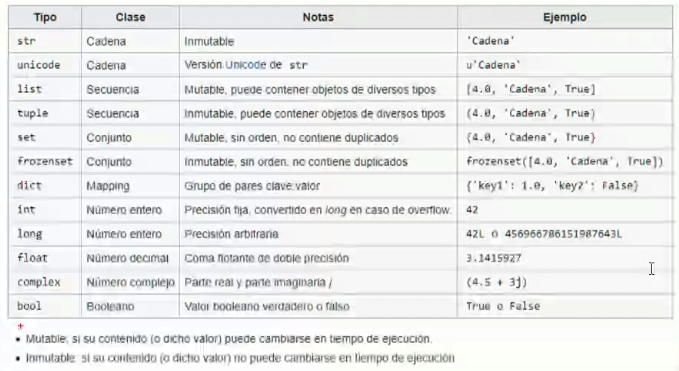

# Introducción
Es un lenguaje de alto nivel **interpretado** dinámico, es decir, que allá donde se ejecute debe ir con su interpretador

Ejemplos de aplicaciones mayormente programadas en **Python**: Netflix, Instagram, Panda 3D, ...

Es un lenguaje multiplataforma y multiparadigma, ya que soporta **parcialmente** la orientación a objetos, programación imperativa y, en menor medida, programación funcional

Es de **código abierto**, lo cual implica que en su página oficial, se puede consultar públicamente su código fuente e incluso aportar cambios (de ahí que su comunidad ayude a la mejora de este)

Administrado por **Python Software Foundation**
(Código abierto: **Python Software Foundation License**)

Se clasifica en la actualidad entre los lenguajes de programación **más populares**


# Para trabajar con Python

Se puede descargar el **IDLE de Python** o **Visual Studio Code** instalando la extensión de **Python** desarrollada por Microsoft junto a una extensión de **Júpiter**


Se puede configurar el entorno para ejecutar mi programa en la versión en la que lo realicé a pesar de las actualizaciones del lenguaje actuales (**aisla el programa en el contexto de la versión para evitar fallos con la actualización o tener que importar nuevos paquetes/librerías**)

# El Zen de Python
Para comprobar que la instalación de Python es correcta, escribimos py en la consola de Windows y luego **import this**:


Al escribir el comando **py**, la consola de Windows abre el intérprete de Python

**Ctr + Z + Enter** para salir del intérprete de Python y volver a la consola de Windows


# Comentarios 
Para hacer comentarios en Python:


# Declaración de variables

Python **intuye** el tipo de dato de la variable, por lo que no es necesaria declararla ya especificada (se le conoce como **Tipo Diferido**)

Le otorga el tipo de dato en el momento que se le agrega un valor

Python es **case sensitive**, por lo que debemos tener cuidado a la hora de identificar las variables y utilizarlas

Forma de **declararlas** y algunas **funciones útiles**:


(**NOTA: es importante seguir el convenio de identificación de variables, que no empiecen por número, que no contengan espacios, etc... en apuntes anteriores de [Fundamentos de Programación](https://github.com/CristinaSilvan/FundamentosProgramacionEOI/blob/main/Apuntes/Anotaciones_de_clase_diario/(4)_20_Abril.md)**)

# La salida de nuestros programas

La salida estandar, es la pantalla

Nuestros programas, si no le especificamos lo contrario, imprimiran en la consola y esta saldrá en la pantalla

# Tipos de datos en Python



El tipo **Unicode** se utiliza para caracteres especiales de otros lenguajes
(nos permite añadir en nuestras cadenas dichos caracteres)

# Conversiones de tipos


# Cadenas de caracteres


Para acceder a cada una de las posiciones de la cadena, al igual que un **array**, se indica de la siguiente forma:
```
nombre="Cristina"
print(nombre[0]) # C
print(nombre[1]) # r
print(nombre[2]) # i
print(nombre[3]) # s
print(nombre[4]) # t
print(nombre[5]) # i
```

También se puede imprimir por rango:
```
nombre="Cristina"
print(nombre[0:6]) # Cristi (no imprime posición 6)
```

Si pido que imprima una posición negativa, cuenta en retroceso desde el final:
```
nombre="Cristina"
print(nombre[-2]) # n
```
(a = -1 | n = -2 | i = -3 | t = -4 | s = -5 | i = -6 | r = -7 | C = -8)

# Funciones útiles para cadenas

.isdigit() -> Consultar si hay un dígito en la cadena
.lower() -> Convertir en minúsculas
.upper() -> Convertir a mayúsculas
.swapcase() -> Convertir minúsculas a mayúsculas y viceversa
len(**_cadena_**) -> Longitud de la cadena
.capitalize() -> El primer caracter en mayúsculas y el resto en minúsculas
.count(**_caracter_**) -> Cuenta cuántas veces se repide el caracter
.replace(**_cadena1_**, **_cadena2_**) -> Reemplaza la cadena1 por la cadena2
.find(**_cadena_**) -> Enumera los caracteres existentes hasta la cadena seleccionada

# Pedir por pantalla (ENTRADA)

Con la función **input()**

Lo asignamos directamente a una variable
```
print("Escriba su nombre: ")
nombre = input()
```

```
nombre = input("Escriba su nombre: ")
```

# Imprimir en pantalla (SALIDA)

* La forma más **eficiente** es con el format:

(porque coge las cadenas y las concatena, mientras que las demás crean una nueva cadena con el resultado de la concatenación)
```
nombre = "Cristina"
edad = 24
print("Mi nombre es {nombre} y tengo {edad}".format(nombre,edad))
```

```
nombre = "Cristina"
edad = 24
print("Mi nombre es {n} y tengo {e}".format(n = nombre, e = edad))
```

```
nombre = "Cristina"
edad = 24
print("Mi nombre es {} y tengo {}".format(nombre, edad))
```
* Usar **format** para imprimir el resultado de una forma específica:

```
numero = 10/3
print("El resultado es {n:1.2}".format(n=numero)) 
# 1.2 significa "un entero con dos decimales"

# En lugar de imprimir 3.3333333333 
# imprime 3.33
```

* Una alternativa simple para usar **format**:

```
print(f"Mi nombre es {nombre} y tengo {edad}")
```

* Otras formas menos eficientes de imprimir:

```
print("Mi nombre es ", nombre, " y tengo ", edad)
```

```
print("Mi nombre es " + nombre + " y tengo " + edad)
```


# Importar

Cada vez que necesitemos usar **funciones** y demás que no vengan de forma nativa con el lenguaje, debemos **importar** el módulo correspondiente 
* Vienen implícitos en la instalación, pero no se encuentran en uso mientras no lo especifique

* Eso permite al programa ser más eficiente ya que solo utiliza los módulos que necesitemos usar


# Fechas y horas

Python no trata las fechas de forma **nativa**


* Now().date() -> Imprime la fecha actual (**SIN**** la hora)
* Now() -> Imprime la fecha actual (**CON** la hora)

Si le asignamos a una variable de tipo **datetime** la función **now().date()**, no albergará la hora y no podremos acceder a esta con **.hour** o **.minute**
(Entonces, tendríamos que usar la función **now()**)

(**NOTA: En este caso, importamos solo la parte del módulo que vamos a usar**)


# Parse de Fechas


En este caso, el Parse o Parseo **analiza gramaticalmente** la variable tipo **Datetime** para imprimir de forma estéticamente más agradable para el usuario

En el ejemplo de la imagen, **recibe una cadena** (en este caso ya declarado) y la **convierte** a una variable de tipo **Datetime**

Consultar [Ejercicio de parseo de fechas](https://github.com/CristinaSilvan/EOI-IntroProgramacionPython/blob/main/Ejercicios%20de%20Clase/QuintoPrograma.py) para más info

# Formato de fechas


Para especificar de una **mejor forma** el formato de la fecha, podemos usar esta otra función que nos permite salirnos del formato por defecto americano

Para establecer por defecto el formato de tiempo en **ESPAÑA**:


# Otros

Desde el intérprete de Python puedo abrir Studio Code con el comando **Code** seguido de la carpeta que queremos que abra o un punto para abrirlo en la actual

Manteniendo pulsado **Alt**, podemos seleccionar varias partes del código por ejemplo para sustituir


El comando **cls** también sirve para **limpiar la consola en Visual Studio Code**